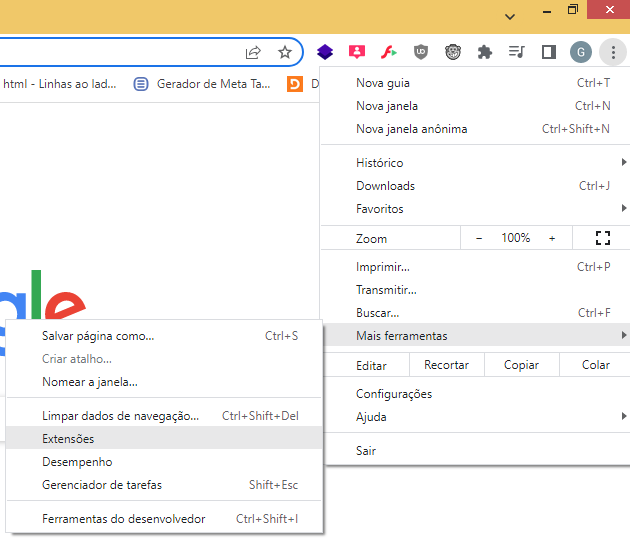
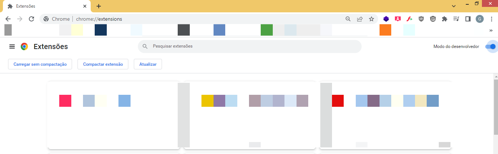
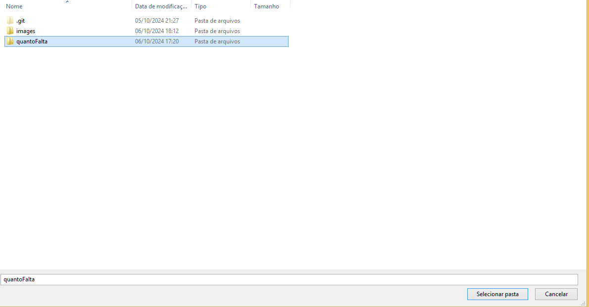
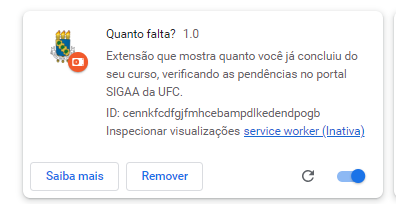
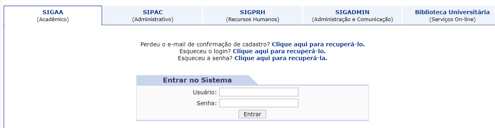
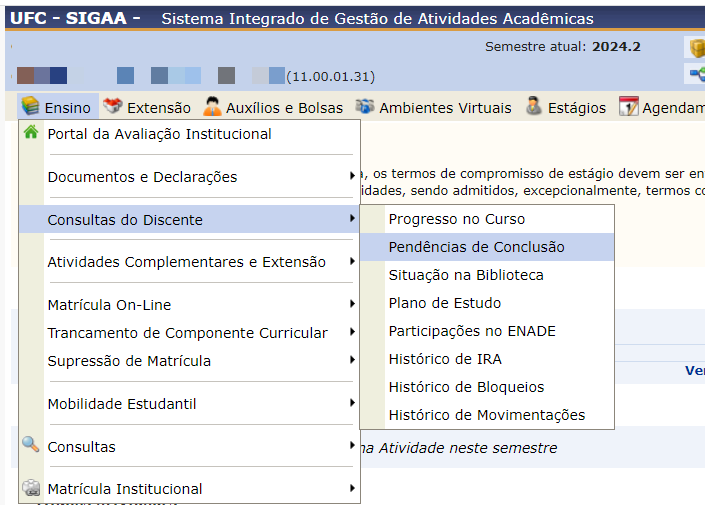
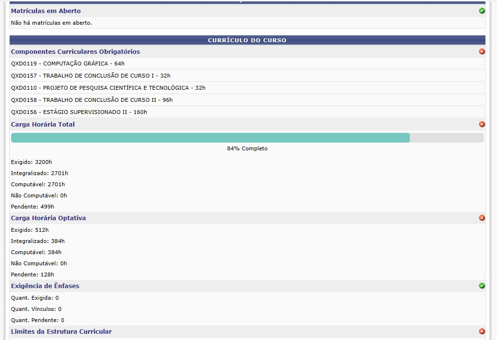

# Quanto Falta?


## Descrição

**Quanto Falta?** é uma extensão para o navegador Google Chrome (e outros baseados no Chromium) que ajuda estudantes da **UFC** a visualizar quanto do curso já foi concluido, verificando as pendências de disciplinas diretamente no portal SIGAA.

## Funcionalidades

- Verifica automaticamente as pendências de conclusão no portal SIGAA e gera uma barra de progresso do que já foi concluído.
- Exibe as informações diretamente no navegador automaticamente.
- Fácil de usar e de instalar.

## Instalação

1. Clone o repositório:
   ```bash
   git clone https://github.com/seu-usuario/quanto-falta.git
   
   
ou baixe o repositório diretamente clicando aqui [aqui](https://github.com/gabriel-bri/quantoFalta/archive/refs/heads/main.zip).

2. Agora, no Chrome, abra o menu do navegador, vá em **“Ferramentas”** e clique em **“Extensões”**



3. Habilite a opção **“Modo do desenvolvedor”** e clique em **“Carregar sem compactação”**



4. Por fim, localiza a pasta onde os arquivos da extensão foram extraídos, seleciona a pasta **quantoFalta** clique em **“Selecionar pasta”**. A extensão será instada



5. Pronto, a extensão está instalada



## Uso

1. Com a extensão já instalada, basta apenas **acessar o SI3 como aluno**:
    


2. Após realizar o login, acesse o menu **Ensino**, logo apoós clique em **Consultas do Discente** e depois em **Pendências de Conclusão**



3. Pronto, agora você verá uma barra de progresso de quanto você já concluiu do curso.

